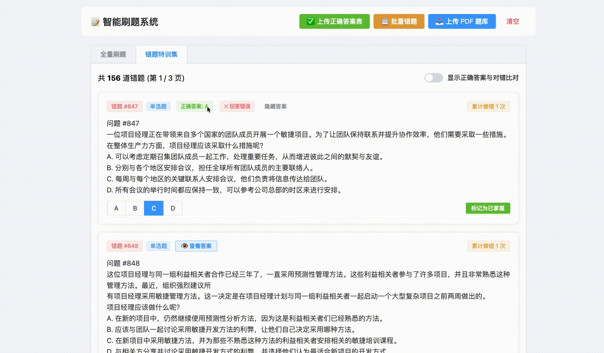

[中文](README.md) | [English](README_EN.md)
# 📝 智能刷题与错题集系统 (Quiz & Mistake Note System)

一个基于 Vue 3 + Element Plus 前端与 Python 后端构建的高效刷题与错题管理系统。支持 PDF 题库解析导入、Excel/CSV 答案匹配、单选/多选题自动识别比对，以及错题集专项特训。
---


---
## 📸 Demo


---
## ✨ 核心功能特色
- **📄 PDF 题库解析与导入**：支持上传 PDF 格式题库，实时展示解析与导入进度日志。
- **✅ Excel/CSV 答案自动比对**：支持上传标准答案表，自动匹配对应题号。
- **🔘 自动识别单选与多选**：根据答案自动切换单选（Radio）和多选（Checkbox）模式，并支持字母乱序精确比对。
- **📋 批量错题导入**：支持通过文本（换行、逗号或空格）批量输入题号，快速生成专项错题集。
- **👁️ 灵活的答案显示控制**：
  - 支持一键开关全局答案与对错比对。
  - 错题集默认隐藏答案，提供单题“查看答案”以及一键批量显示功能。
- **⚡ 60题高性能分页与跳转**：优化海量题目的加载体验，支持快捷回到顶部。

---

## 🛠️ 技术栈

- **前端 (Frontend)**: Vue 3 (Composition API), Element Plus, Axios, HTML5/CSS3
- **后端 (Backend)**: Python (FastAPI / Flask), PyPDF2 / pdfplumber, Pandas / OpenPyXL
- **数据存储**: SQLite / JSON 文件存储

---

## 🚀 快速开始

### 1. 克隆项目
```bash
git clone [https://github.com/your-username/quiz-system.git](https://github.com/your-username/quiz-system.git)
cd quiz-system
```

### 2. 后端配置与启动
```bash
# 进入后端目录（如有）
cd backend

# 安装依赖
pip install -r requirements.txt

# 启动后端服务 (以 FastAPI 为例)
uvicorn main:app --reload --port 8000
```

### 3. 前端运行
直接在浏览器中打开 frontend/index.html 文件，或通过本地 HTTP 服务器（如 VS Code Live Server / Python http.server）运行。

📖 使用指南 
1. 上传题库：点击顶部【上传 PDF 题库】按钮，等待解析完成。

2. 导入答案：点击【上传正确答案表】，上传对应的 Excel 或 CSV 文件。

3. 开始刷题：
- 在“全量刷题”选项卡中进行练习，开启顶部开关可实时比对答案。
- 做错的题目可点击【加入错题本】。

4. 错题特训：

- 切换到“错题特训集”进行针对性复习。
- 可使用【📋 批量错题】直接导入指定题号列表。
- 掌握后可点击【标记为已掌握】移出错题集。


